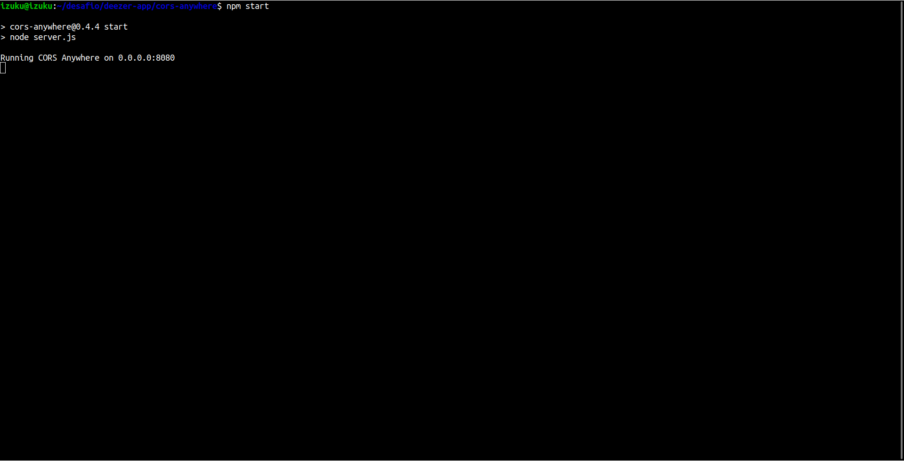
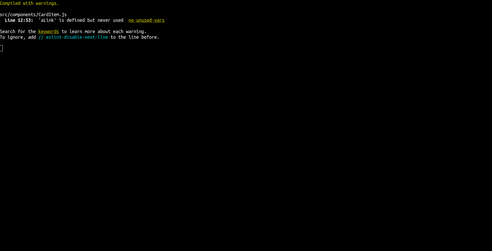
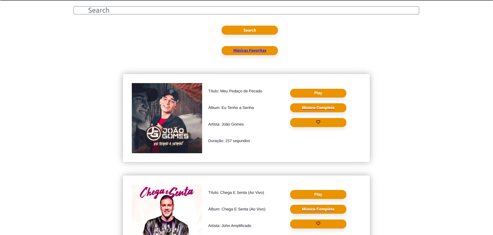
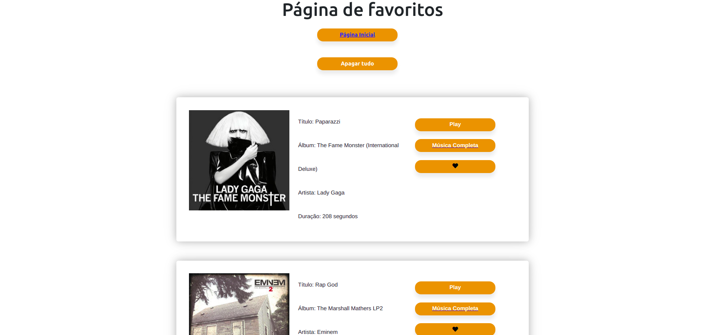

<header>
  <h1>PROJETO DEEZER APP</h1>  
    
Desenvolvido em ReactJS e Redux, o Deezer App foi desenvolvido para se conectar a API da Deezer.

     
     
    <a href="https://github.com/tryber/sd-011-project-recipes-app/tree/main-group-8">BRANCH ORIGINAL</a>
</header>

##

<main>
  <h2>TECNOLOGIAS</h2>
  <ul>
    <li>ReactJS</li>
    <li>Redux</li>
    <li>Axios</li>
    <li>Styled Components</li>
    <li>React Sound</li>
  </ul>
</main>

<section>
  <h3>API UTILIZADA</h3>
    <ul>
      <li><a href="https://developers.deezer.com/">Deezer API</a></li>
    </ul>
</section>

<section>
  <h3>OBSERVAÇÕES</h3>
    
<b>Tive um problema ao fazer requisição de dados para a API. Devido a isso foi necessário adicionar um submódulo, um repositório do GitHub capaz de corrigir esse problema. Por isso é necessário seguir atentamente o passo a passo de como rodar.</b>

  <h3>COMO RODAR O DEEZER APP</h3>
  <ol>
    <li>Clone o repositório;</li>
    <li>Na raiz do projeto utilize o comando <b>"git submodule update --init"</b>;</li>
     <li>Entre na pasta 'cors-anywhere' e verifique se os arquivos foram baixados, após isso execute o comando <b>"npm install"</b>;</li>
    <li>Na raiz do projeto utilize o comando <b>"npm install"</b>;</li>
    <li>Agora será necessário ter dois terminais abertos, em um deles você devera entrar na pasta 'cors-anywhere' e no outro deverá estar na raiz do projeto. Execute o comando <b>"npm install"</b> em ambos.</li>
     
  </ol>
  
No final os terminais estarão assim:

  
  
</section>

##

<section>
  <h3>REFERÊNCIAS:</h2>
    <ul>
      <li>
      <a href="https://github.com/Rob--W/cors-anywhere">Cors Anywhere</a>
      </li>
      <li>
      <a href="https://www.npmjs.com/package/react-sound">React Sound</a>
      </li>
      <li>
      <a href="https://codesandbox.io/s/nwjmr73vl?file=/src/Card.js:118-338">Styled Components</a>
      </li>
    </ul>
</section>
